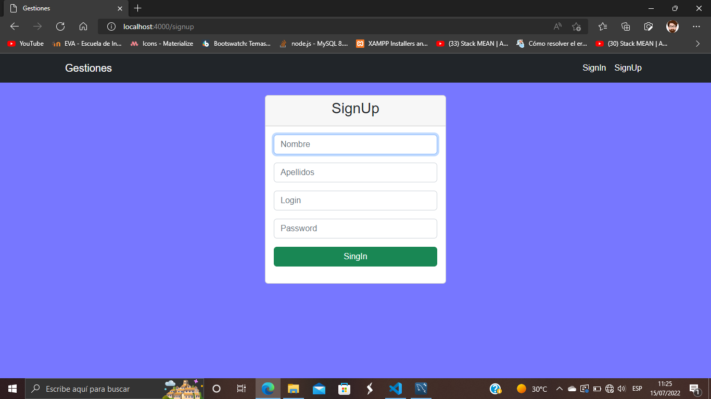

# Test De Conocimiento App Con Nodejs y Mysql

## File Structure
- database, it the folder with all the sql queries, you can use to recreate the database for this application
- src, it's all the code for the Backend and Frontend Application
- docs

